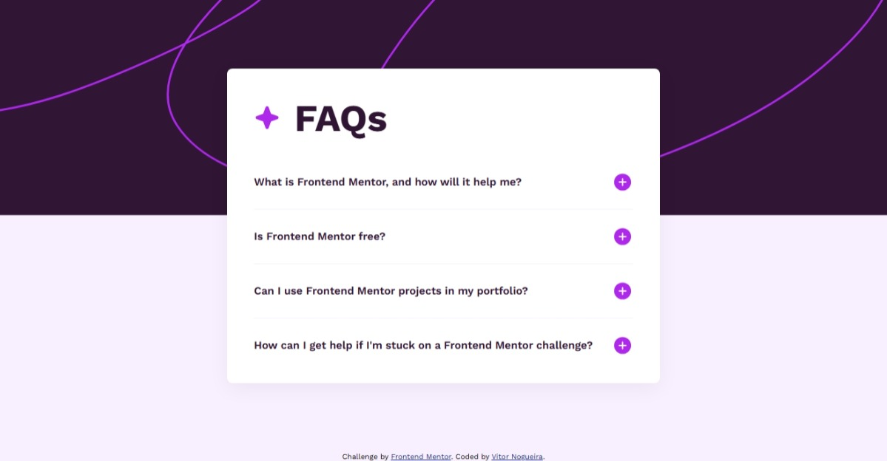

# Frontend Mentor - FAQ accordion solution

This is a solution to the [FAQ accordion challenge on Frontend Mentor](https://www.frontendmentor.io/challenges/faq-accordion-wyfFdeBwBz). Frontend Mentor challenges help you improve your coding skills by building realistic projects. 

## Table of contents

- [Overview](#overview)
  - [The challenge](#the-challenge)
  - [Screenshot](#screenshot)
  - [Links](#links)
- [My process](#my-process)
  - [Built with](#built-with)
  - [What I learned](#what-i-learned)
- [Author](#author)

**Note: Delete this note and update the table of contents based on what sections you keep.**

## Overview

### The challenge

Users should be able to:

- Hide/Show the answer to a question when the question is clicked
- Navigate the questions and hide/show answers using keyboard navigation alone
- View the optimal layout for the interface depending on their device's screen size
- See hover and focus states for all interactive elements on the page

### Screenshot



### Links

- Solution URL: [https://github.com/VitorEmanoelNogueira/faq-accordion-main](https://github.com/VitorEmanoelNogueira/faq-accordion-main)
- Live Site URL: [https://vitoremanoelnogueira.github.io/faq-accordion-main/](https://vitoremanoelnogueira.github.io/faq-accordion-main/)

## My process

### Built with

- Semantic HTML5 markup;
- BEM methodology;
- CSS custom properties;
- Flexbox;
- Mobile-first workflow.

### What I learned

- How to use the `<details>` and `<summary>` tags for building accessible accordions without JS;
- How to styles the transitions for the details elements using the `::details-content` pseudo-element;
- Hot to use the `prefers-reduced-motion` media query for accessibility.

```css
.c-faq__question::after{
    content: "";
    width: 2rem;
    height: 2rem;
    flex-shrink: 0;
    background: url(../assets/images/icon-plus.svg) center / contain no-repeat;

    transition: transform 0.4s ease;
}

.c-faq__item[open] .c-faq__question::after{
    background: url(../assets/images/icon-minus.svg) center / contain no-repeat;

    transform: rotate(180deg);
}

.c-faq__item::details-content{
    opacity: 0;
    transition:
        opacity 0.4s,
        content-visibility 0.4s allow-discrete;
}

.c-faq__item[open]::details-content{
    opacity: 1;
}

@media (prefers-reduced-motion: reduce) {
    .c-faq__item::details-content, 
    .c-faq__question::after{
        transition: none;
        animation: none;
    }
}
```

## Author

- Frontend Mentor - [@VitorEmanoelNogueira](https://www.frontendmentor.io/profile/VitorEmanoelNogueira)